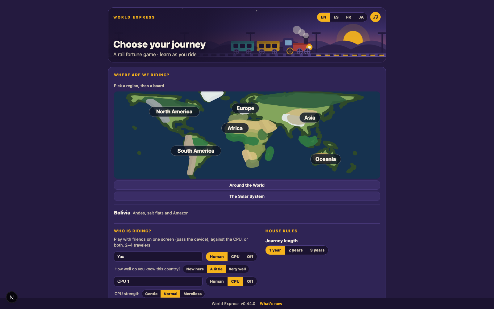
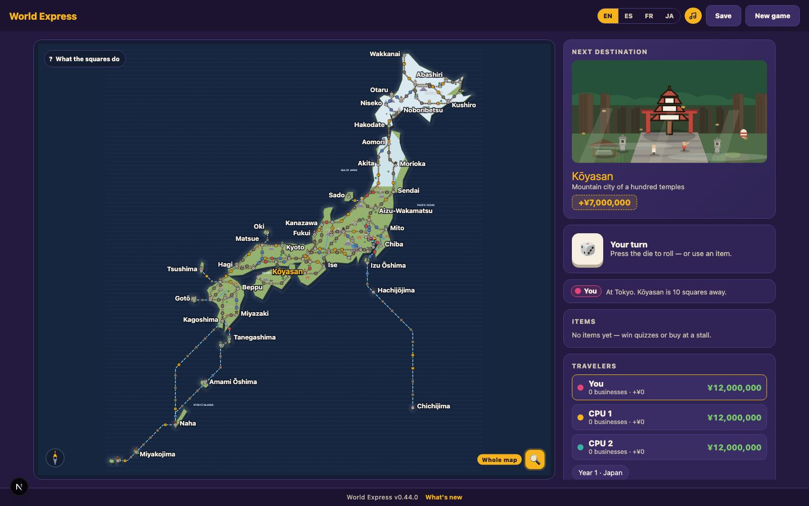

# World Express — a rail fortune game

> **World Express is a free, browser-based multiplayer board game in which 2–4 players roll dice to travel a real railway map, buy businesses in real towns, answer geography quizzes, and race to a destination — playable in English, Spanish, French and Japanese across 47 boards covering six continents, the whole globe and the solar system.**

**[▶ Play it in your browser](https://t29mato.github.io/grand-express/)** — no install, no account, no ads.

<sub>A mirror also runs at [grand-express.vercel.app](https://grand-express.vercel.app); the link above is the canonical one.</sub>

> This game was built almost entirely by AI agents (Claude Code) under human direction — including the clean architecture design, TDD test suite, and CI setup. It is part of an experiment in AI-orchestrated OSS development.



**Stack:** Next.js (App Router) · React · TypeScript · Zustand · Vitest · Playwright · dependency-cruiser · deployed on Vercel.

**Analytics:** page views are counted with Vercel Web Analytics. It sets no cookies, does not track across sites and collects nothing that identifies a visitor — chosen over the usual analytics precisely so there is no consent banner.

---

## What it is

You and up to three others — human or CPU, all on one screen — ride the rails. Each turn you
roll, move along real railway lines, and land on a square:

- **A town.** Buy a business there. Own every business in a town and its income doubles.
- **A quiz.** Answer a question about the place you are standing in. Get it right, get paid.
- **Fortune squares.** Something happens that could plausibly happen *there* — a monsoon
  delay in Kerala, a strike in Buenos Aires, a customs hold at a break-of-gauge border.

First to reach the destination gets paid. The traveler in last place picks up a spirit of
misfortune, drawn from that region's own folklore, who rides along and makes everything worse
until someone else falls behind.



### 47 boards

Six continents (Europe, Asia, Africa, North America, South America, Oceania), a whole-globe
board, the solar system, and country and regional boards including Japan, Bolivia, India,
France, China, Brazil, Canada, Australia, Ukraine, Morocco, Ghana, Turkey, Korea, Malaysia,
Indonesia, Bali, Ibaraki Prefecture and Japan's Hundred Famous Mountains.

**2,218 towns and 3,849 quiz questions**, each written in all four languages. Every town card
carries something true and specific about that place — not a tourist blurb. Where the history
is ugly, it says so plainly rather than skipping it.

## Put it on your phone

Open <https://t29mato.github.io/grand-express/> on the phone, then:

- **iPhone / iPad (Safari)** — share button → *Add to Home Screen* → *Add*
- **Android (Chrome)** — the ⋮ menu → *Add to Home screen* / *Install app*

It gets its own icon and opens without an address bar. **It runs offline** — boards you have
opened before stay playable with no connection. When a new version is out, the game says so at
the bottom of the screen and waits for you to press *Update*; it never swaps itself while you
are mid-game.

## Run it locally

```bash
npm install
npm run dev            # http://localhost:3000
```

| Command | What it does |
|---|---|
| `npm run dev` | Development server |
| `npm run build` | Production build |
| `npm run test` | Unit and component tests (Vitest) |
| `npm run test:e2e` | End-to-end tests (Playwright; run `npx playwright install chromium` once first) |
| `npm run lint` / `npm run typecheck` | ESLint / TypeScript |
| `npm run depcruise` | Enforces the Clean Architecture dependency direction |
| `npm run check` | Everything above, plus build and E2E — the same gate CI runs |
| `npm run shot -- japan overview` | Screenshot a board from the running dev server |
| `node scripts/extract-legacy-content.mjs` | Rebuild content JSON from the authoring sources |

## How it is put together

```
src/
  domain/           Game rules. Zero dependencies, zero framework.
  application/      Use cases and port definitions.
  infrastructure/   Content JSON, localStorage, audio, randomness.
  presentation/     Zustand stores and React components.
app/                Next.js App Router — routing only.
scripts/countries/  Authoring sources for each board (cities, routes, quizzes, art).
docs/               Architecture notes, ADRs, testing strategy, authoring guides.
legacy/             The original single-file HTML version, frozen as the behavioural spec.
e2e/                Playwright tests.
```

The dependency direction is not a convention here — `dependency-cruiser` fails the build if an
inner layer reaches outward. **106 test files** cover the domain rules, the content pipeline and
the rendered board.

Board content is generated: `scripts/countries/<board>/` and `scripts/content-overrides/` are the
sources, `src/infrastructure/content/*.content.json` is the output. Never edit the output.

Design notes and the migration history are in [docs/](./docs/README.md) (written in Japanese).

## About the experiment

The game began as one 2,964-line HTML file. Everything since — the Clean Architecture split, the
DDD domain model, the TDD suite, the CI gate, the content pipeline, the 30 boards, the SVG
artwork and the procedural music — was produced by AI agents working under human direction, often
several agents in parallel on separate boards with a human and a coordinating agent reviewing
what came back.

That review mattered. Agents shipped questions whose answers were already printed on the town card
the player had just read, called Sedna a dwarf planet, and dated Japan's record wind gust to the
wrong typhoon. Those were caught by measuring rather than by reading — the repository carries the
checking scripts (`scripts/check-quiz.mjs`, `scripts/check-sea-routes.mjs`,
`scripts/check-city-backgrounds.mjs`, `scripts/check-quiz-risky.mjs`) that exist because each of
those failures happened at least once.

## Licence

**No licence has been chosen yet.** Until one is added, default copyright applies and no
permission to reuse this code is granted. If you want to use any of it, open an issue and ask.

Town descriptions, quiz questions and artwork were written for this project. Place names,
railway facts and historical events are, of course, nobody's property.
