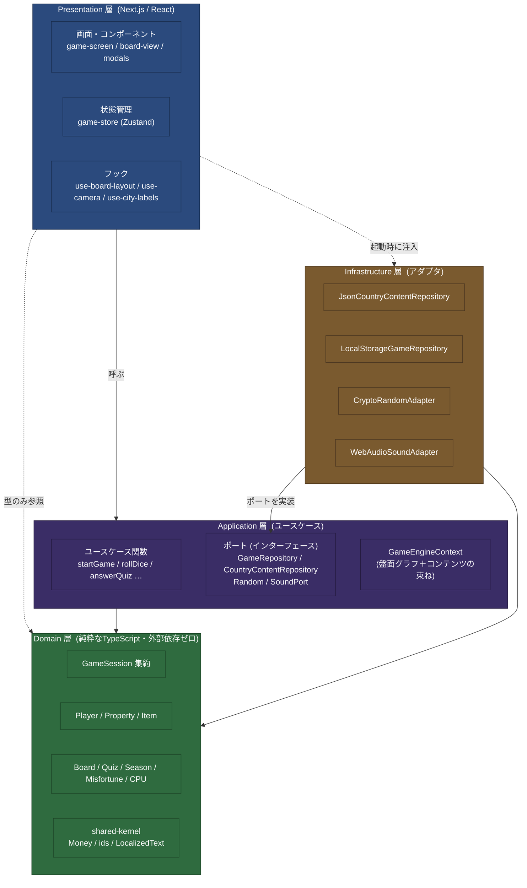
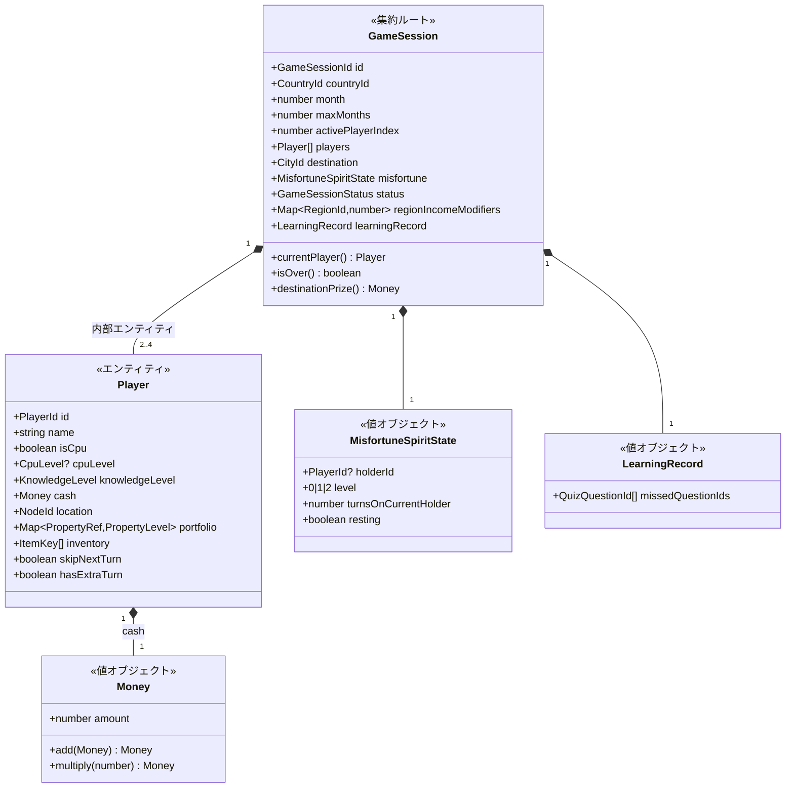
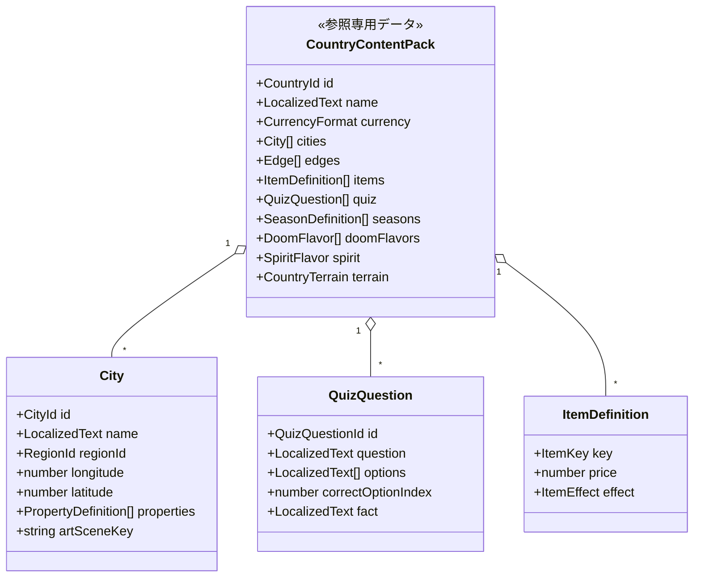
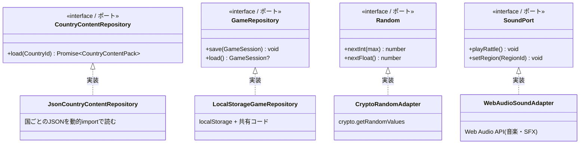
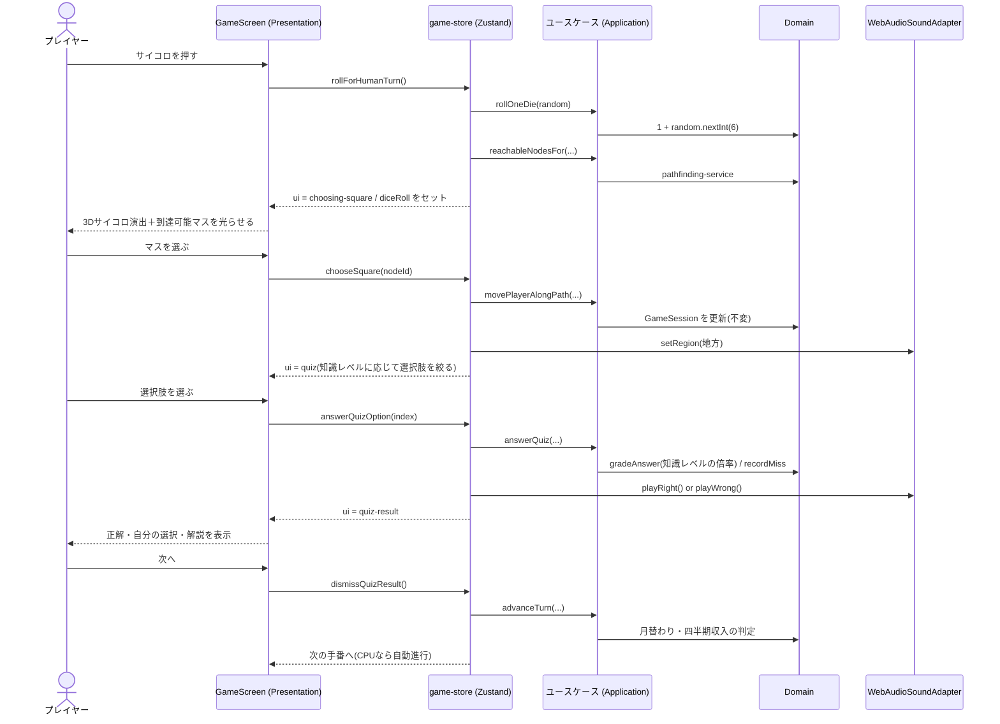
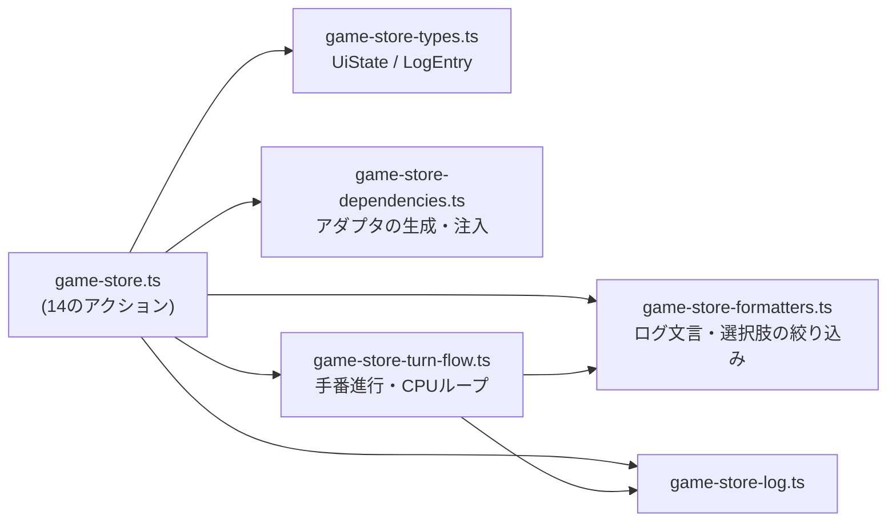

# 10-05. 構造の図(クラス図・シーケンス図)

このプロジェクトの構造を図で示す。**依存の向きは常に外側から内側**で、
Domain 層はどの層にも依存しない([10-01](./01-clean-architecture-overview.md))。

> 図は Mermaid で書いてある。GitHub 上ではそのまま描画される。

## 0. この資料の位置づけ(どれがクラス図で、どれがパッケージ図か)

図の種類が混ざっていると読み違えるので、先に整理しておく。

| 節 | 図の種類 | 何を伝えるか |
|---|---|---|
| 1 | **パッケージ(層)図** | 4層の関係と依存の向き。クラス図ではない |
| 2 | **クラス図** | Domain 層の集約・エンティティ・値オブジェクトの関連 |
| 3 | **クラス図** | ポート(インターフェース)とアダプタの実装関係 |
| 4 | **シーケンス図** | 1手番で層をまたいで何が起きるか |
| 5 | **パッケージ図** | Presentation 層内部のファイル分割 |

**この資料は手書き**であり、意図や関連(所有・実装)を伝えることを目的とする。
一方、**実装から自動生成した依存関係グラフ**は
[10-06](./06-dependency-graph.md) にある。「今の実装が実際どうなっているか」は
そちらが正で、CI で内容の陳腐化を検出している。

## 1. 全体像 — 4層と依存の向き

**依存性逆転**: Application 層は「保存する」「乱数がほしい」「音を鳴らす」を
**ポート(インターフェース)**として宣言するだけで、実装は知らない。
Infrastructure 層がそれを実装し、Presentation 層が起動時に注入する
(`game-store-dependencies.ts`)。これにより Domain / Application はブラウザAPIから
完全に切り離され、Node 上のテストでそのまま動く。

## 2. Domain 層 — 集約とエンティティ

`GameSession` が唯一の集約ルート。`Player` は集約内部のエンティティで、
`GameSession` を通してのみ変更する([ADR-0002](./04-adr/) / [02-domain-model-ddd](./02-domain-model-ddd.md))。

### 参照専用のコンテンツ(ライフサイクルを持たない)

都市・アイテム・クイズなどは**ゲーム中に変化しないマスターデータ**なので、
集約の外に `CountryContentPack` として置き、`GameEngineContext` から参照する。

### ドメインサービス(状態を持たない計算)

集約に属さない計算はドメインサービスとして関数で置く。

| サービス | 役割 |
|---|---|
| `board-graph-builder` | 都市と路線から盤面グラフを組み立てる |
| `pathfinding-service` | サイコロの目から到達可能なマスを求める |
| `property-income-service` | 物件の収入・独占・売却額の計算 |
| `quiz-grading-service` | 正誤判定と、知識レベルによる増減額の補正 |
| `season-effect-applier` | 季節イベントの効果適用 |
| `destination-selection-service` | 次の目的地の抽選 |
| `cpu-move-strategy` / `cpu-city-strategy` / `cpu-item-strategy` | CPUの意思決定 |

## 3. Application 層 — ポートと依存性逆転

矢印が **Infrastructure → Application** を向いている点が要点で、これが依存性逆転である。
Application 層のコードは `JsonCountryContentRepository` の存在を知らない。

## 4. 1手番の流れ(シーケンス)

人間プレイヤーがサイコロを振ってクイズマスに止まった場合。

## 5. Presentation 層の内部

`game-store` は **Application 層のユースケースを呼ぶだけの薄いアダプタ**で、
ゲームのルールを持たない([ADR-0002](./04-adr/))。ファイルが大きくなったため
役割ごとに分割してある。

## 6. 図と実装のずれを防ぐ

この図は手で書いたものなので、実装と乖離しうる。**機械的に検証しているのは
`dependency-cruiser` のルール**(`.dependency-cruiser.cjs`)であり、
以下は CI で常に守られている。

- Domain 層は Application / Infrastructure / Presentation に依存しない
- Application 層は Infrastructure / Presentation に依存しない
- Infrastructure 層は Presentation に依存しない

依存の**向き**が壊れれば CI が落ちる。一方で「どのクラスがどれを持つか」といった
細部は自動検証されていないため、構造を大きく変えたときはこの図も更新すること。
