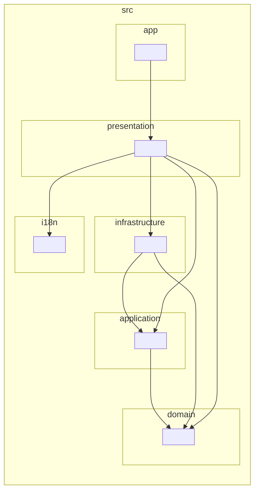
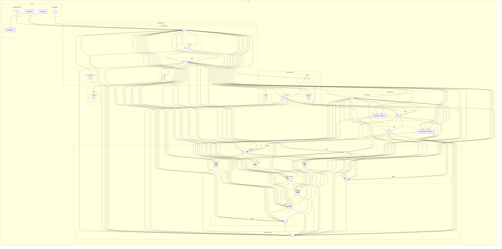
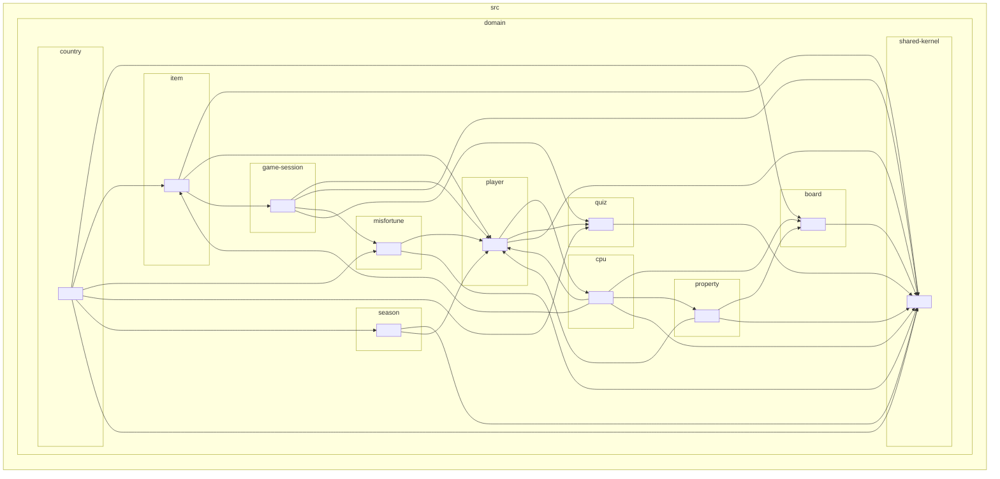

# 10-06. 依存関係グラフ(自動生成)

> **このファイルは自動生成される。** 手で編集しても次の生成で上書きされる。
> 更新するには `npm run graph` を実行すること。
> CI では `npm run graph:check` が生成結果とこのファイルを突き合わせ、
> 構造を変えたのに図を更新していない場合に失敗する。

[10-05 クラス図](./05-class-diagram.md) が**手書きで意図を伝える図**なのに対し、
こちらは **dependency-cruiser が実際の `import` をたどって描いた図**である。
実装と必ず一致するので、「本当は今どうなっているか」を知りたいときはこちらを見る。

生成コマンド(テストと外部パッケージは構造の関心事ではないので除外している):

```bash
npm run graph
```

## 1. 層の依存(パッケージ図)

Clean Architecture の要である**依存の向き**がひと目で分かる粒度。
矢印はすべて外側から内側(Presentation → Application → Domain)を向いており、
内側から外側への矢印が無いことが重要。



- `infrastructure` から `application` への矢印は、**ポート(インターフェース)を実装
  している**ことを表す。依存性逆転が効いているので、`application` から
  `infrastructure` への矢印は無い。
- `presentation` が `infrastructure` を指しているのは、起動時にアダプタを
  生成して注入しているため(`game-store-dependencies.ts`)。

## 2. パッケージ単位の依存

層の中をもう1段掘り下げた図。どのユースケースがどのサブドメインを使っているか、
といった粒度で読める。辺の数が多いので、全体の傾向を見る用途に使う。



## 3. ドメインのサブドメイン間の依存

DDD 上の関心事。`game-session` が他のサブドメインを束ねる集約であること、
`shared-kernel` が全体から参照されていることが読み取れる。



> フォルダ単位で双方向の矢印が出ることがある(例: `cpu` と `player`)。これは
> 「`cpu` の戦略が `Player` を読み、`Player` が `CpuLevel` 型を参照している」
> というように**別々のファイル同士**が参照し合っている状態で、モジュール単位の
> 循環参照ではない。モジュールの循環は `.dependency-cruiser.cjs` の
> `no-circular` ルールで禁止しており、CI で常に検証している。

## この図で保証されること・されないこと

| | |
|---|---|
| 保証される | ここに描かれた矢印は、実際に存在する `import` である |
| 保証される | 層をまたぐ依存の向き(`no-*-to-*` ルール)は CI で検証されている |
| 保証されない | クラス同士の関連(所有・集約・継承)。それは [10-05](./05-class-diagram.md) の手書き図が担う |
