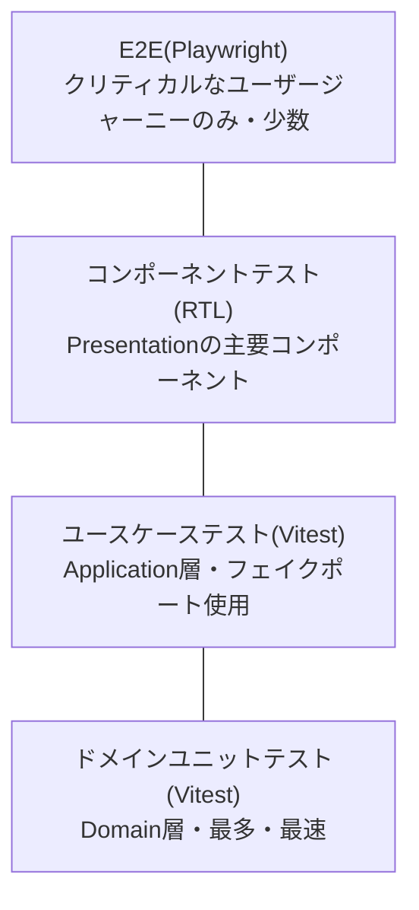
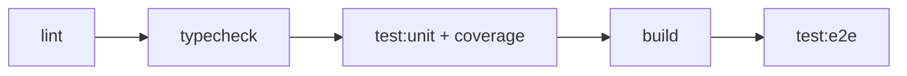

# 20-01. テスト戦略(TDD)

## 1. テストピラミッド

- 数量比の目安: Domain > Application > Component > E2E
- Domain/Application層は**フレームワーク非依存**なので実行が高速(ミリ秒単位)。TDDのRed-Green-Refactorを
  高速に回せる場所であり、ここに最も厚くテストを書く。
- E2Eは実行コストが高いため、「これが壊れたらリリースしてはいけない」レベルのシナリオに絞る。

## 2. TDDの適用範囲と進め方

| 層 | TDD適用 | 進め方 |
|---|---|---|
| Domain | 必須 | 現行HTMLの実際の挙動(計算式・分岐条件)を仕様としてテストを先に書く → 実装 → リファクタ |
| Application | 必須 | ユースケースごとに「正常系1つ以上+代表的な異常系」を先に書く。ポートはフェイク実装を使う |
| Infrastructure | 契約テストを先に書く(TDD厳密運用は任意) | ポートのインターフェースに対する契約テスト(例: `GameRepository` の実装は同じテストスイートを満たすこと)を用意し、実装前/実装後に流す |
| Presentation | 任意(テストファーストにこだわらない) | 主要コンポーネント(盤面・ダイス・モーダル)についてはRTLで「表示される/クリックでコールバックが呼ばれる」程度を確認 |

### Red-Green-Refactorの具体例(収入計算)

1. **Red**: 「レベル3の物件は `incAt(inc, 3)` = `Math.round(inc*(1+0.55*2))` になる」というテストを先に書き、失敗させる
2. **Green**: `PropertyIncomeService.incomeAt()` を実装してテストを通す
3. **Refactor**: マジックナンバー `0.55` を `INVESTMENT_INCOME_MULTIPLIER` のような名前付き定数に置き換える

現行コードの計算式(`incAt`, `upCost`, `investedIn`, `sellValue`, `playerIncome`, `monopolyCount` など)は
**そのまま仕様の一次情報**として使い、移行時に挙動を変えないことを最優先する(挙動を変える場合は
別途Issue化してから対応する)。

## 3. ツールと役割

| ツール | 役割 |
|---|---|
| Vitest | Domain/Applicationのユニットテスト、Presentationコンポーネントテストのランナー |
| React Testing Library | コンポーネントテスト(ユーザー視点での検証) |
| Playwright | E2E(実ブラウザ、モバイルviewport、タッチ操作) |
| zod | セーブデータ/コンテンツデータのスキーマ検証(テストでも不正データの検出を確認) |
| fast-check(任意) | 収入計算・独占判定などの数式に対するプロパティベーステスト(境界値の網羅) |
| dependency-cruiser | レイヤー間import違反の静的検査(CIで実行、テストというよりゲート) |

## 4. カバレッジ目標

| 層 | 目標カバレッジ(line) |
|---|---|
| Domain | 90%以上 |
| Application | 85%以上 |
| Infrastructure | 契約テストで主要パスをカバー(数値目標は設けない) |
| Presentation | 主要コンポーネントのみ(数値目標は設けない) |
| 全体 | 70%以上 |

カバレッジは「品質の証明」ではなく「テストされていない危険な箇所を可視化する指標」として使う。
数値稼ぎのための無意味なテストは書かない。

## 5. テストダブル方針

- `RandomNumberGenerator` ポート: 本番は暗号乱数/`Math.random`ベースのアダプタ、テストでは
  固定値または決定的な疑似乱数(シード指定)のフェイクを使う。CPU戦略や厄災の神の発動判定など、
  確率が絡むロジックはこれで決定的にテストする。
- `Clock` ポート: 日時に依存する処理があれば固定時刻のフェイクを使う。
- `GameRepository`: `InMemoryGameRepository` をApplication層のテストで使用する。
- ネットワークやWeb Audioなど副作用の強いものは、Application/Domainのテストには一切登場させない。

## 6. E2E シナリオ一覧(クリティカルユーザージャーニー)

| # | シナリオ | 目的 |
|---|---|---|
| 1 | セットアップ→人間1名+CPU1名でゲーム開始→数ターン進行 | 基本フローが壊れていないことの確認 |
| 2 | 都市に停車→物件購入→増資→売却 | 経済まわりの主要導線 |
| 3 | クイズマスで正解/不正解の両方を確認 | クイズ機能の主要導線 |
| 4 | 独占達成(1都市の全物件を購入)して収入2倍を確認 | ドメインルールのうち特に間違えやすい箇所のE2E確認 |
| 5 | 厄災の神が発動し、いずれかの災難が実行される | 複雑な分岐を持つ機能の疎通確認 |
| 6 | セーブ→ページリロード→ロードして続きから再開 | 永続化の疎通確認 |
| 7 | 4言語それぞれでセットアップ画面が表示できる(smoke) | i18nの疎通確認(全文言の検証はしない) |
| 8 | 規定月数が経過してゲーム終了・勝者判定画面が出る | ゲーム終了フローの確認 |

これ以上の細かい分岐(全71問のクイズ、全18種のアイテム効果など)はDomain/Applicationのユニットテストで
網羅し、E2Eでは「疎通していること」の確認に留める(E2Eで組み合わせ爆発を起こさない)。

## 7. CI パイプライン

- PRごとに `lint → typecheck → test:unit → build` を必須ゲートとする。
- `test:e2e` はPRでも実行するが、実行時間短縮のため上記E2Eシナリオ一覧のみに絞る
  (フルリグレッションのE2Eはリリース前のみ実行、というように分離してもよい)。
- `dependency-cruiser` によるレイヤー違反検査は `lint` ステップに含める。

## 8. 現行コードからのテスト移行手順(Discovery Testing)

新規実装の前に、現行 `grand-express.html` を実際に動かして仕様化テスト(Characterization Test)の
元ネタとする。

1. 現行コードの計算関数(`incAt`, `upCost`, `sellValue`, `investedIn`, `playerIncome`, `monopolyCount`,
   `netWorth`, `bfsDist`, `reachable` など)を、代表的な入力・出力の組をメモとして書き出す
2. それを Domain層のユニットテストの初期ケースとして先に書く(Red)
3. Domain層を実装してテストを通す(Green)
4. 現行コードとロジックが一致していることを確認できたら、現行コード側の該当箇所は
   `legacy/` に退避したファイルとして参照専用にする
