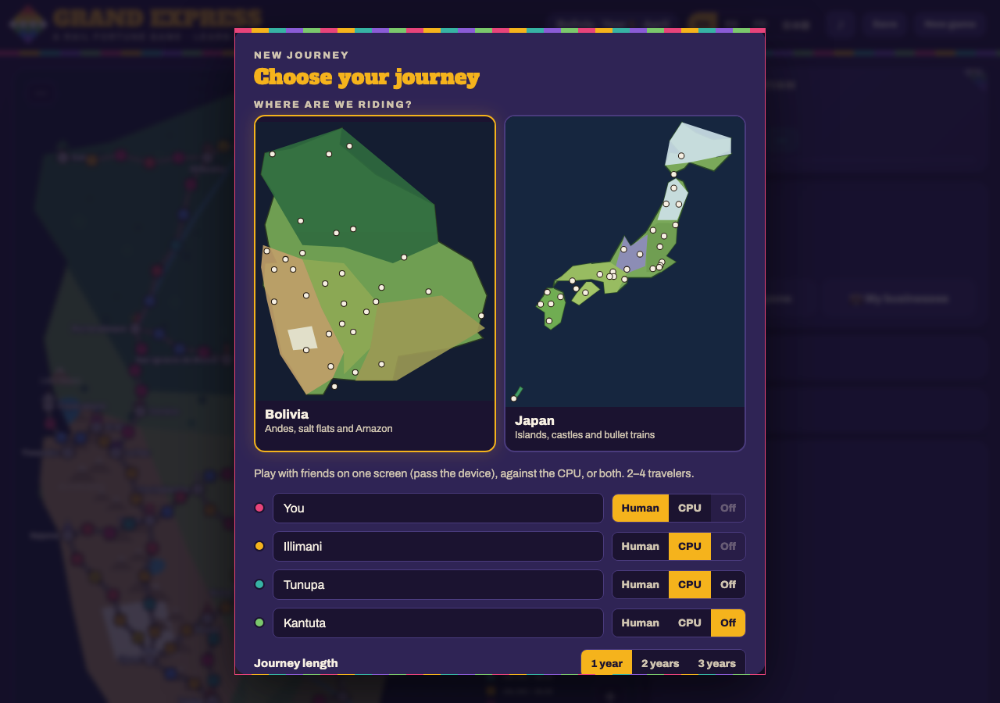
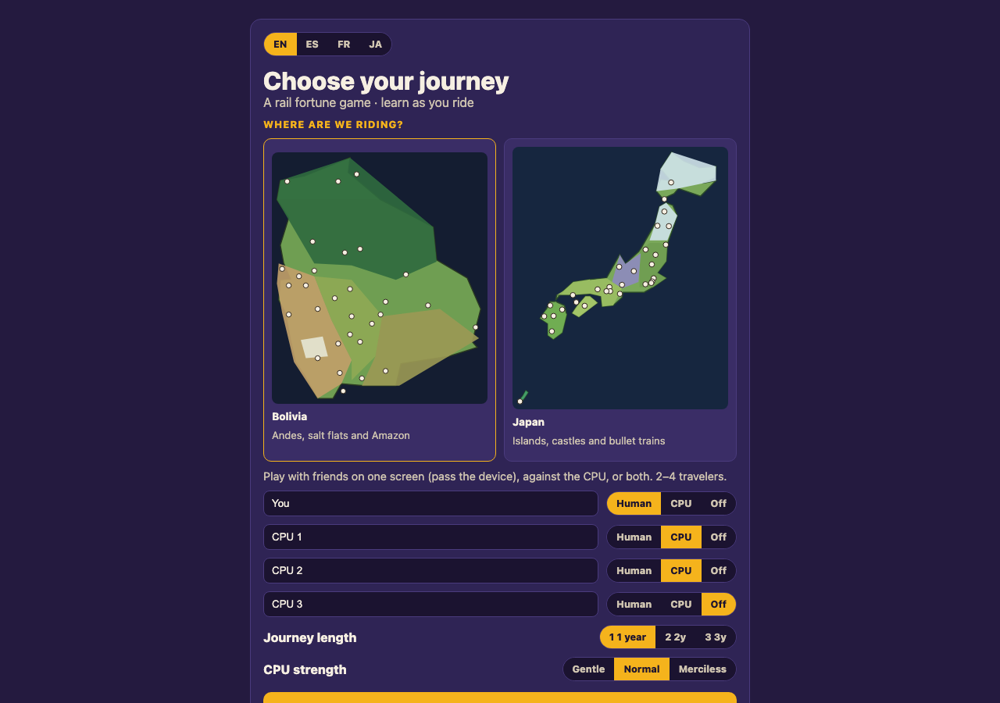
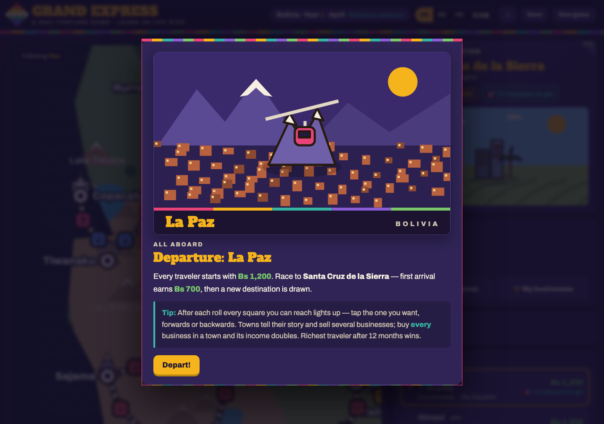
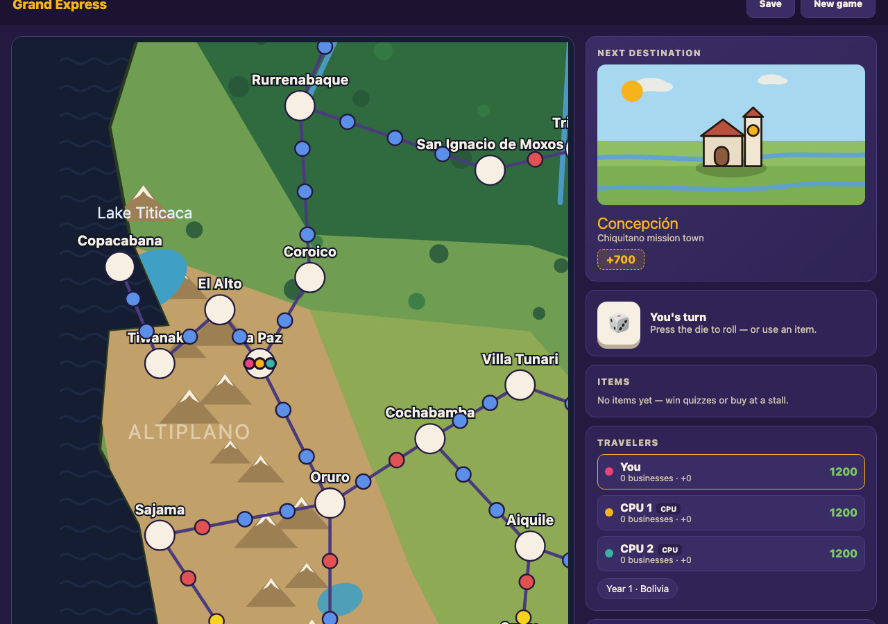
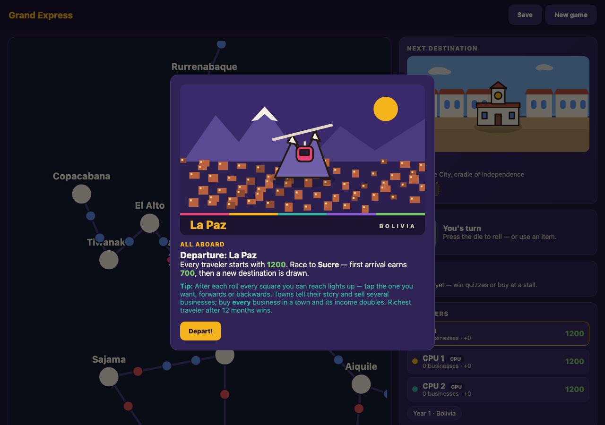

# 90-05. 現行版とのビジュアル比較(2026-08-05時点のスクリーンショット)

Phase 8/9.2の「現行版との厳密なピクセル単位のビジュアル突合QA」を進めるための一次資料。
`legacy/grand-express.html` と新アプリを実際にスクリーンショットして並べ、差分を洗い出した
(1280×900、Chromium)。**最終的な「どこまで作り込むか」の判断は人による確認が前提**だが、
判断材料をゼロから探す状態は解消し、以下の具体的な差分リストから着手できる状態にした。

再撮影する場合は `npm run build && npm run start -- -p 3100` でこのリポジトリを起動した上で、
Playwright(`playwright` はdevDependencyとして導入済み)でlegacyのファイルURLと
`http://localhost:3100` の両方を開いてスクリーンショットすればよい。

## 1. セットアップ画面

| legacy | 新アプリ |
|---|---|
|  |  |

**差分**:
- legacyは国選択カードに手描き風のポリゴンイラスト(ボリビア=山と密林、日本=列島の地形)が
  あり、都市の位置が白い点で示されている。新アプリはカード内がテキストのみ(ADR-0007で
  記録済みの意図的な簡略化)。
- legacyはヘッダーに虹色のグラデーション帯とロゴ・キャッチコピー(「A RAIL FORTUNE GAME」)
  があり、その背後に(プレイ中なら)盤面がぼかして透けて見える。新アプリはセットアップ専用の
  独立した画面で、背後に盤面はない(そもそも構造が「常時1画面にオーバーレイ」から
  「setup/gameの2画面切替」に変わっているため、これはアーキテクチャ上の意図的な差)。
- 配色・フォントの太さ・ボタンの角丸などトーン&マナーはおおむね近い(パープル系の背景、
  ゴールドのアクセント、太字見出し)。

## 2. ゲーム画面(ゲーム開始直後)

| legacy(到着ストーリーのモーダル表示中) | 新アプリ |
|---|---|
|  |  |

**差分**:
- ~~legacyはゲーム開始時に到着都市(La Paz)の手描き風イラスト付き「出発ストーリー」モーダルが
  表示される。新アプリはこの導入ストーリーモーダル自体を実装していない~~ →
  **対応済み(2026-08-05)**。`intro-modal.tsx` を実装し、さらに**手描きイラストも
  `city-art.tsx` として移植済み**(下の「4」参照)。実際の描画結果は
   のとおりで、legacyとほぼ同一。
- legacyの盤面は都市ごとに手描きの地形イラストが敷かれ、都市アイコンも装飾的。新アプリは
  円形ノード+直線エッジの抽象的な表示(ADR-0007に記録済みの意図的な簡略化)。
- 情報パネル(所持金・アイテム・ログ等)の情報量自体はほぼ同等(現在地、次の目的地、
  所持金、アイテム、プレイヤー一覧、ログ)。新アプリの方がパネルの余白が広くフラットな
  カードデザインで、legacyの方が装飾(区切り線・アイコン・グラデーション)が多い。
- ダイスの3D物理演出(バウンド・回転)は本セッションで新アプリにも実装済み(該当コミット参照)。
  見た目のディテール(3D的な質感・影の落ち方)までの一致は未確認(スクリーンショットは
  静止画のため、アニメーション自体の質感比較は実際に動かして目視確認する必要がある)。

## 3. 未着手・今後人が判断すべき項目

- ~~盤面の地形イラスト~~ → **対応済み(2026-08-05)**。`terrain-layer.tsx` として、
  海+波模様・陸の落ち影・陸・地形・装飾(山/木/サボテン)・湖・河川・地名ラベルを
  legacyの `drawBoard()` と同じ重ね順・色・線幅で描くようにした。
- ~~国選択カードのポリゴン地図~~ → **対応済み(2026-08-05)**。legacyの `countryThumb()` と
  同じ描画を抽出時に生成し、軽量インデックス(`country-index.json`)にSVG文字列として
  持たせた(地形データ本体を読み込まずに描画できる。インデックスは約1KB→約9KB)。
- ヘッダーの装飾(虹色の帯、ロゴのサブタイトル)を追加するかどうか。
- 路線(レール)の3層描画(枕木のダッシュ表現)と、盤面上の都市ノードのシンボル表示は未実装
  (現状は単色の円+ラベル)。これらも同じくlegacyの `drawBoard()` に定義がある。

## 4. 都市イラストの移植(2026-08-05 対応済み)

当初「デザイン方針の意思決定が必要」として保留していたが、legacy側の実装を読んだところ
**`G.bg[...]` は引数なし・乱数なしの純粋関数**(組み立てに使う `band`/`dotc`/`clouds`/
`treeRow` もすべて決定的)であることが分かった。したがって「どう描くか」を人が決める余地は
そもそもなく、**抽出スクリプトで一度実行して結果のSVG文字列を保存するだけ**で、
1ピクセルも変えずにデータとして移植できる。

- `scripts/extract-legacy-content.mjs` に `evaluateBackgrounds()` を追加し、
  `bg` の各シーンを評価してコンテンツJSONへ保存(2回呼んで同じ結果になることも検証している。
  将来legacy側に乱数が混ざったら抽出時点でエラーになる)。
- 都市のシンボル(`marks`)は元々SVG文字列なのでそのまま抽出できていた。
- `city-art.tsx` が背景+影+シンボル+キャプション帯を legacy の `cityArt()` と同じ
  重ね順・座標・スケール(`s=4.1`, `gy=152`)で合成する。
- 適用箇所: 出発ストーリー(`intro-modal`)、町のモーダル(`city-modal`)、
  次の区間の案内(`next-leg-modal`)、目的地カードのサムネイル(`side-panel`、legacyの
  `destThumb` と同じ `bare` 版)。

## 更新履歴

- 2026-08-05: 初版作成(Phase 8の音楽エンジン・3Dダイス演出の実装後、残る視覚差分を
  可視化する目的でスクリーンショット比較を実施)。
- 2026-08-05: 都市イラストの移植を完了し、「3」「4」を更新。
- 2026-08-05: 盤面の地形レイヤーと国選択カードの地図も移植し、「3」を更新。
  最新の描画結果は `assets/new-board.png` / `assets/new-setup.png` を参照。
